# findGEVE: GEVE identification tool in eukaryotic genome assemblies


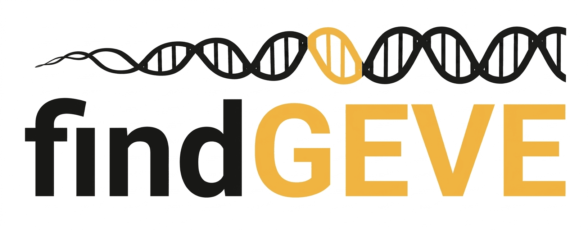

Many Giant Endogenous Viral Elements (GEVEs) genomes from Nucleocytoplasmic Large DNA Viruses (NCLDVs) have been known to be integrated into various eukaryotic genomes. Various bioinformatics tools have been developed to identify GEVEs in genome assemblies, such as [Viralrecall](https://github.com/faylward/viralrecall), [genomAD](https://github.com/apcamargo/genomad/), and [VirSorter2](https://github.com/jiarong/VirSorter2). However, these tools lack GEVE boundary detection methods (TIR & TSD), and their output still requires many processing steps before it is suitable for downstream analysis. 

Here, I present **findGEVE** for end-to-end GEVE identification, with output ready for downstream analysis.

**More detail about this script:**
- Inspired by Viralrecall, with many improvements for more robust GEVE identification.
- Fully written in Python, with only one external dependency, which is BLAST+.
- Uses three different HMM databases: NCLDV hallmark, GVOG, and Pfam v38.
- Features automated TIR and TSD identification based on the flanking regions of each candidate GEVE.
- Produces output files suitable for downstream analysis, such as phylogenetic tree.

> *You can also read findGEVE introduction slide [here](docs/findGEVE_introduction.pdf)*

## Table of Contents
- [findGEVE: GEVE identification tool in eukaryotic genome assemblies](#findgeve-geve-identification-tool-in-eukaryotic-genome-assemblies)
  - [Table of Contents](#table-of-contents)
  - [1. Requirements](#1-requirements)
    - [1.1 Third party Python packages:](#11-third-party-python-packages)
    - [1.2 External Python packages:](#12-external-python-packages)
    - [1.3 HMM database](#13-hmm-database)
  - [2. Installation](#2-installation)
  - [3. Quick usage guide](#3-quick-usage-guide)
    - [3.1 Run with test data](#31-run-with-test-data)
    - [3.2 Output files](#32-output-files)
  - [4. findGEVE algorithm detail](#4-findgeve-algorithm-detail)
    - [4.1 ORF/Gene prediction](#41-orfgene-prediction)
    - [4.2 HMM annotation](#42-hmm-annotation)
    - [4.3 Seed candidate GEVE via hallmark clustering](#43-seed-candidate-geve-via-hallmark-clustering)
    - [4.4 Rolling viral score calculation](#44-rolling-viral-score-calculation)
    - [4.5 Per-cluster boundary refinement](#45-per-cluster-boundary-refinement)
      - [4.5.1 TIR detection algorithm](#451-tir-detection-algorithm)
    - [4.6 TSD identification algorithm](#46-tsd-identification-algorithm)
  - [5. Author](#5-author)
  - [6. Citation](#6-citation)
  - [7. Acknowledgment](#7-acknowledgment)

---
## 1. Requirements
This tool is fully written in Python and mostly uses third-party Python packages that can be installed using pip. `findGEVE.py` is compatible with `Python v3.8` or higher. Make sure your already have python installed in your system.
### 1.1 Third party Python packages:
- `numpy` v1.24 or hinger
- `pandas`  v2.0 or hinger
- `matplotlib` v3.0.0 or hinger
- `pyfastx` v2.3.0
- `pyhmmer` v0.12.0
- `pyrodigal-gv` v0.3.2

```
# install using pip (RECOMENDED)
pip install numpy pandas pyfastx pyhmmer pyrodigal-gv

# or install using conda
conda install -c conda-forge -c bioconda numpy pandas pyfastx pyhmmer pyrodigal-gv
```
### 1.2 External Python packages:
- BLAST+ with `blastn` v2.17.0+ available in `$PATH`

```
# install using conda
conda install bioconda::blast
```

### 1.3 HMM database
This tool use 3 different HMM database, including NCLDV hallmark genes, GVOG, and Pfam.  The `database` directory (`-db/--db`) must contain:

```
NCLDV_markers.hmm        # required
gvog.complete.hmm        # required
gvog.complete.annot.tsv  # required for functional annotation
Pfam-A.hmm               # optional (BETTER PROVIDE IT)
```

1. The NCLDV_markers.hmm file is already available in this repository at `database/NCLDV_markers.hmm`. Many thanks to [Dr. Frank Aylward](https://scholar.google.com/citations?user=JLV6g2AAAAAJ&hl=en) and his team, who created this database and make it open souce. 
2. The Giant Virus Orthologous Groups (GVOG) database can be downloaded from its [official website](https://faylward.github.io/GVDB/). Make sure to download the `.hmm` file and rename it to `gvog.hmm`. 
3. The latest version of the Pfam database can be downloaded from [EMBL-EBI](https://www.ebi.ac.uk/interpro/download/pfam/) 

Alternatively, you can use this command to download GVOG and Pfam database:
```
# For GVOG database
wget https://zenodo.org/record/4728209/files/GVOGs.tar.gz

# For Pfam database
wget https://ftp.ebi.ac.uk/pub/databases/Pfam/current_release/Pfam-A.hmm.gz
```
## 2. Installation
Clone the repository and make the script executable:
```
git clone https://github.com/dedee95/findGEVE.git
cd findGEVE
chmod +x findGEVE.py
```

In the future I will make this tool available for pip and conda installation.
## 3. Quick usage guide
After all dependencies are installed, type the help command (`./findGEVE.py –h`) to check if the tool is working properly.

```
findGEVE.py - Identify Giant Endogenous Viral Elements (GEVEs) in eukaryotic genome assemblies.

Usage: findGEVE.py -db <directory> --prefix <prefix> <genome.fa> [OPTIONS]

Mandatory:
  -db, --db            HMM database directory (must contain NCLDV_markers.hmm
                       and gvog.complete.hmm; Pfam-A.hmm is optional)
  --prefix             Output prefix for GEVE IDs and file names
  genome               Input genome assembly FASTA (gzip is acceptable)

Optionals:
  -o, --outdir         Output directory                              [default: ./Result_<YYYYMMDD>]
  -t, --threads        CPU threads for ORF prediction and HMM search [default: 4]
  -e, --evalue         E-value cutoff for HMM searches               [default: 1e-5]
  --blastn-jobs        Parallel TIR-detection workers                [default: --threads]
  -m, --min-hallmark-type
                       Minimum number of distinct hallmark types
                       required in the final retained GEVE           [default: 2]
  -l, --min-geve-len   Minimum GEVE length                           [default: 50_000]
  --cluster-merge-gap  Maximum gap (bp) between same-contig clusters [default: 100_000]
  -h, --help           Show this help and exit
```

### 3.1 Run with test data
Example using test data obtained from [Science](https://www.science.org/doi/10.1126/science.ads6303) paper:
```
./findGEVE.py \
	test/Chlamydomonas_reinhardtii.contig536.fa \
	-db database \
	--prefix Chlamydomonas \
	--threads 16 \
	--min-hallmark-type 3 \
	--blastn-jobs 8
```

The input genome can be plain FASTA or gzip-compressed FASTA.
### 3.2 Output files
Retained GEVE are sorted by contig and position, assigned IDs, and store to output directory.

```
├── Chlamydomonas.geve.fna        # Retained GEVE sequence (TIR included)
├── Chlamydomonas.summary.tsv     # Per-GEVE summary table
├── Chlamydomonas.markerout       # Hallmark genes, TIR, and TSD coordinate
├── Chlamydomonas.geve.gff        # Annotated GEVE relative to host genome
├── Chlamydomonas.geve.cds        # Coding sequence for each retained GEVE
├── Chlamidomonas.func.tsv        # Functional annotation for each retained GEVE proteins
├── Chlamydomonas.geve.pep        # Protein sequence for each retained GEVE
└── hallmark/                     # Per-hallmark type protein sequence (suitable for phylogenetic)
	├── Chlamydomonas.d5.pep  
	├── Chlamydomonas.rnapl.pep  
	├── Chlamydomonas.polb.pep  
	├── Chlamydomonas.rnaps.pep  
	├── Chlamydomonas.mcp.pep  
	├── Chlamydomonas.rnr.pep  
	├── Chlamydomonas.a32.pep  
	├── Chlamydomonas.mrnac.pep  
	└── Chlamydomonas.vltf3.pep
```

A predicted GEVE candidate is supported by the presence of multiple NCLDV-like hallmark genes. The presence of TIR and TSD also provide additional structural evidence. However,  candidates GEVE can still be reported without TIRs then it will use viral-score to determine it's boundary.
## 4. findGEVE algorithm detail
This tool has six main steps for robust GEVE identification. It can be used on contig- or chromosome-level genome assemblies.
1. **ORF/gene prediction** using Pyrodigal (ignoring contigs ≤ 50 kb).
2. **Hallmark gene scanning** and retaining contigs with positive hallmark genes, followed by GVOG and Pfam scanning on those contigs.
3. **Seeding candidate GEVEs** by sliding a window over hallmark genes and clustering regions with ≥ 2 hallmark types within 300 kb.
4. **Calculating a rolling viral score** per ORF (window = 15) as a smoothed `virbit` – `pfambit` signal to delineate candidate GEVE boundaries.
5. **Per-cluster boundary refinement** via TIR detection using BLASTN self-vs-self alignment of the candidate GEVE. If no TIR is found, the GEVE boundary is determined based on the rolling viral score.
6. **TSD identification** for candidate GEVEs where TIRs are detected.
### 4.1 ORF/Gene prediction
The genome FASTA is indexed with `pyfastx`. Every contig shorter than `min_contig` (default 50 kb) is discarded. Each surviving contig is dispatched to a worker process running `pyrodigal` in `meta=True` mode. pyrodigal metagenomic mode is being used because it does not assume a single genetic code or codon-usage profile and is appropriate for hunting integrated viral genes inside a host background. 
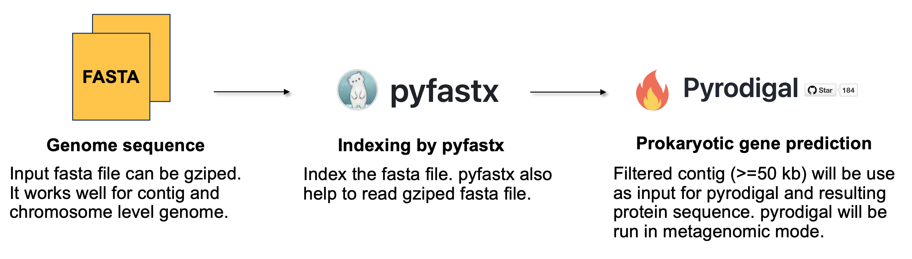
### 4.2 HMM annotation
Three sequential `pyhmmer` scans with same E-value cutoff (`evalue`, default **1e-5**), narrowing the search space at each step. List of hallmark genes: *A32, D5, SFII, mcp, mRNAc, PolB, RNAPL, RNAPS, RNR, VLTF3*.
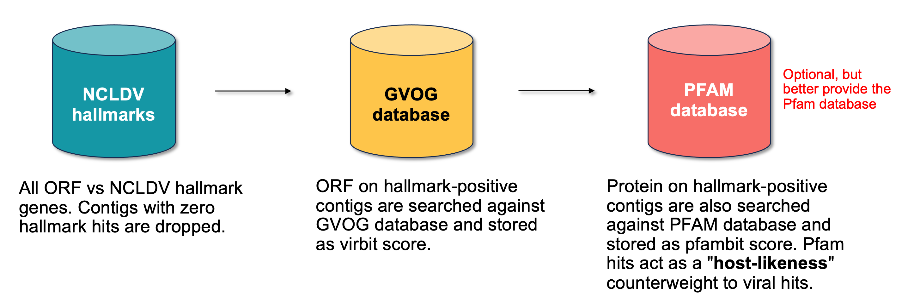
### 4.3 Seed candidate GEVE via hallmark clustering
Finds genomic regions containing multiple distinct viral hallmark types within a sliding window. By default it slides a `300 kb` window over hallmark genes and require `≥2` distinct hallmark types.

**For each contig with hallmark hits**
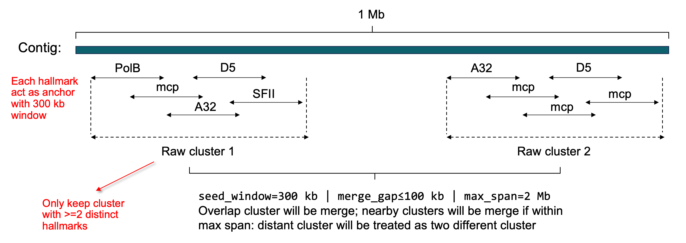
**Merging process**

Many anchors produce overlapping windows. Any two clusters on the same contig whose spans overlap are merge together. After this pass, every cluster on a contig is non-overlapping. If there any two adjacent clusters it will be merge if their inter-cluster gap is `≤ 100 kb` and the merged span would not exceed `2 mb`.

Example case for two cluster in the same contig are merged: 
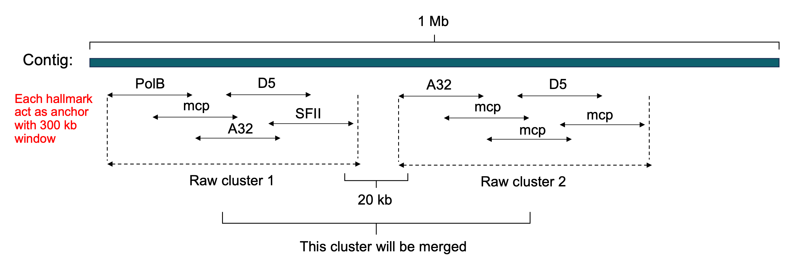

Example case for two cluster in the same contig are NOT merged: 
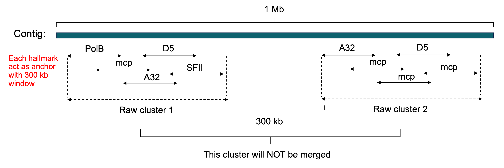
### 4.4 Rolling viral score calculation
Computes a viral enrichment score per candidate contig using `net_score = virbit - pfambit` to retain high confident viral region.

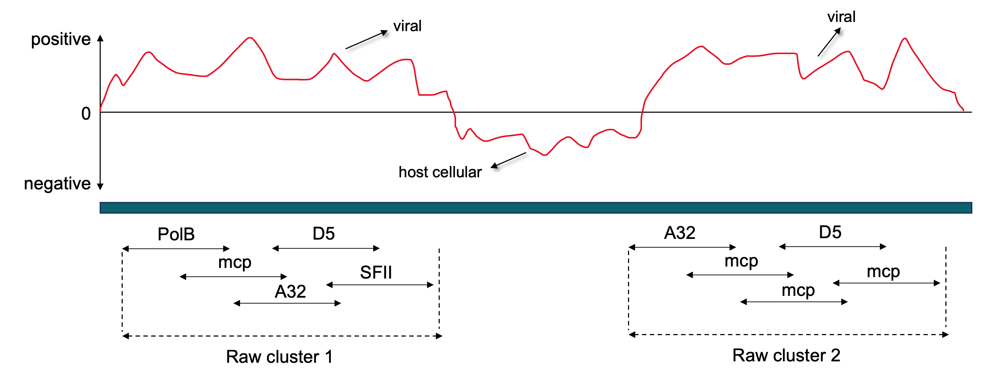

**More detail about viral score**
- **Giant Virus Orthologous Groups** (GVOG) database covering most NCLDV-encoded functions.
- **Pfam** database is dominated by cellular protein families. in this case pfam ack like host representative.

```
viral score = virbit (max(NCLDV, GVOG)) - pfambit
```

Viral score calculated by subtracting virbut (GVOG) with pfambit (PFAM). Viral region will be resulting in positive value and host likeness (cellular) will resulting zero or negative value.

>*“So, a strong Pfam hit on an ORF without a strong viral hit suggests the protein (ORF) is part of the host, not the integrated viral element.”*

Viral score in this tool also be used to determine cluster candidate GEVE boundary before go to TIR identification step.
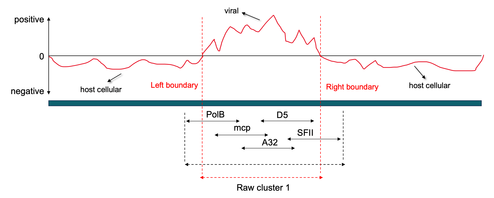
### 4.5 Per-cluster boundary refinement 
Each cluster candidate GEVE is processed end-to-end for TIR identification to retain it robust region. If no valid TIR is found, boundaries are retained from the viral-score evidence.

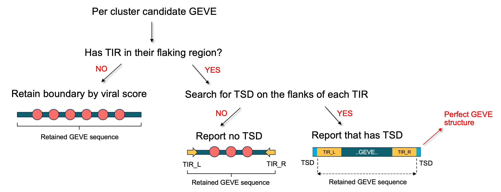
#### 4.5.1 TIR detection algorithm
Many integrated NCLDVs retain Terminal Inverted Repeats (TIRs) at both ends of the integrant in opposite orientations. They are the structural signature of integration and the strongest evidence that a region is a coherent unit, NOT an artifact of clustering. 

TIR identification conduction by using `blastn` self-vs-self forward with reverse-complement strand on the cluster candidate GEVE ± flanking. 

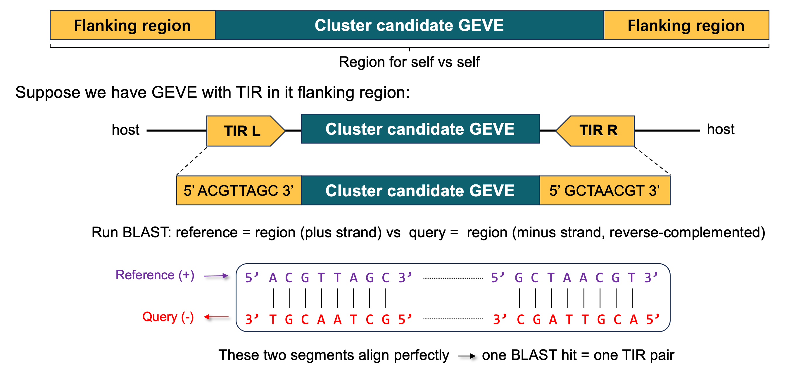
Actually, we don't know how big the GEVE is yet, so we don't know how wide a window to `blastn`. `findGEVE.py` tries growing windows (a "flank ladder") to find a TIR sequence:

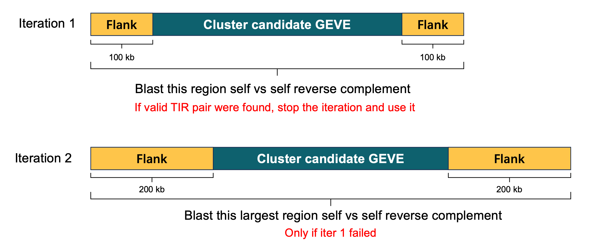
A TIR candidate must pass four criteria:

| Criteria  | Default thresholds                                     |
| --------- | ------------------------------------------------------ |
| `insert`  | 30,000 bp ≤ insert_size ≤ 1,500,000 bp                 |
| `len`     | 10 bp ≤ tir_length ≤ 10,000 bp                         |
| `id`      | tir_identity ≥ 65 %                                    |
| `bracket` | encloses all detected hallmarks                        |

Retained TIR sequence will be real TIR sequence, not just low complexity repeat like mono- or dinucleotide repeat.

### 4.6 TSD identification algorithm
Many GEVE duplicate a short host sequence (TSD) on both flanks of the insertion. So, if TIR pair were found, then check the target site duplication (TSD) in TIR flank region.

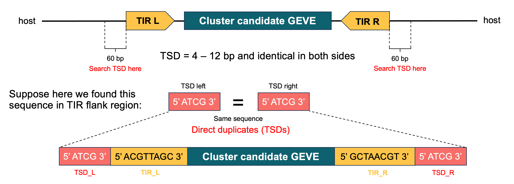

The detector scans `tsd_search_window = 60 bp` on each flank for a k-mer match where `k ∈ [tsd_min, tsd_max] = [4, 12]`, preferring the longest match. Mismatches and slide tolerance scale with k:

| k     | max miss | rationale                                             |
| ----- | -------- | ----------------------------------------------------- |
| `≤ 5`   | 0        | short TSDs must be perfect to be credible             |
| `6–8`   | 1        | mid-length TSDs tolerate one mismatch                 |
| `≥ 9`   | 2        | long TSDs may carry mutations from age of integration |

Up to `tsd_max_slide = 2 bp` of positional offset is allowed on each side to absorb ±1–2 bp errors in the TIR boundary call. TSDs are only attempted when a TIR was found; without a defined boundary there is nothing to flank.
## 5. Author
Dede Kurniawan
- Linkedin: [https://www.linkedin.com/in/dede-kurniawann/](https://www.linkedin.com/in/dede-kurniawann/)
- E-mail: [dedekurniawan@genomics.cn](mailto:dedekurniawan@genomics.cn)
## 6. Citation
No prior publication yet for this tool. If you use this tool in your research, please cite the repository for now.

> Kurniawan, D. 2026. findGEVE: GEVE identification tool in eukaryotic genome assemblies. https://github.com/dedee95/findGEVE

## 7. Acknowledgment
- Big thanks to [Dr. Frank Aylward](https://scholar.google.com/citations?user=JLV6g2AAAAAJ&hl=en) who made viralrecall version 1 and curated the hallmark HMM database. This tool Inspired by Viralrecall. 
- Thank to Dr. Wang Sibo & Dr. Xu Yan for valuable suggestions to improve this tool.